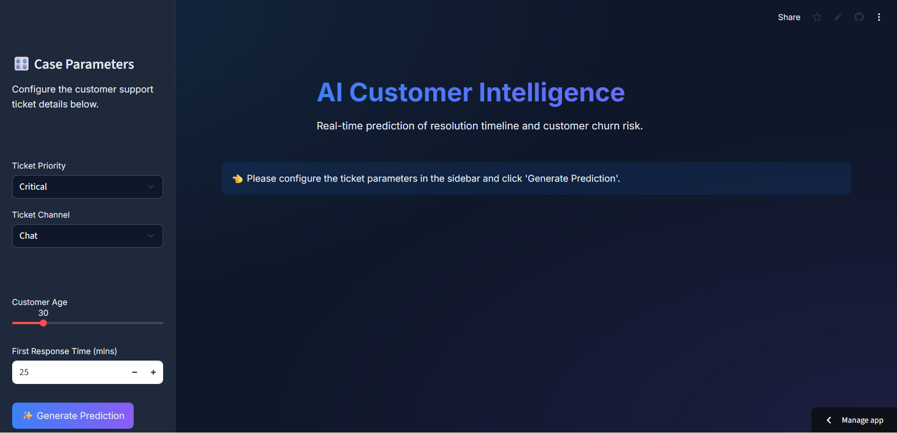
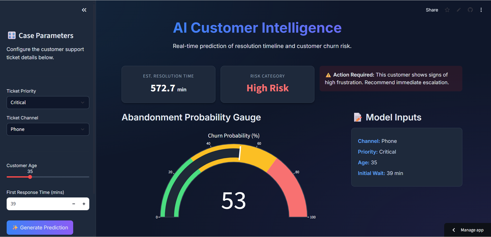
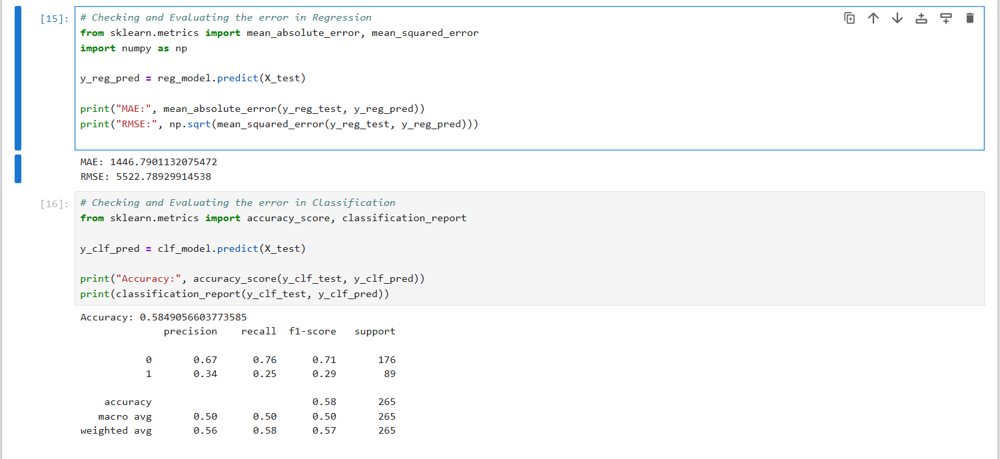
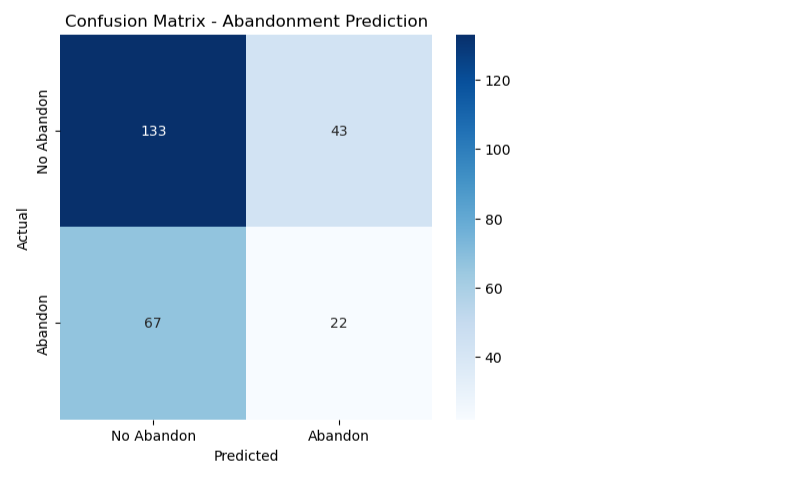
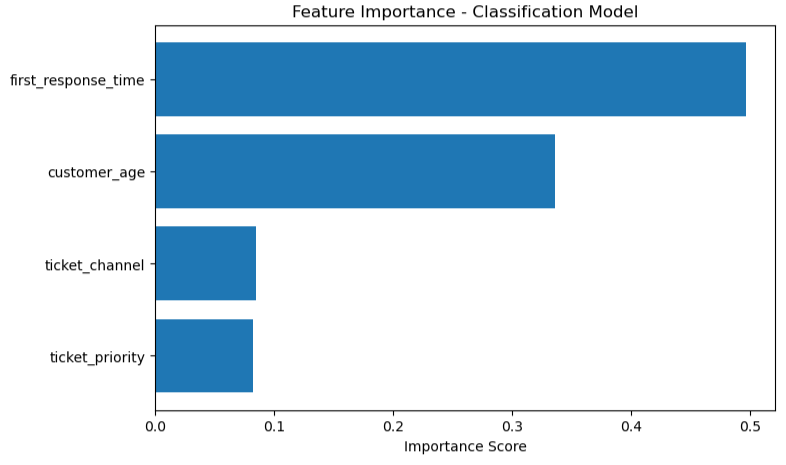
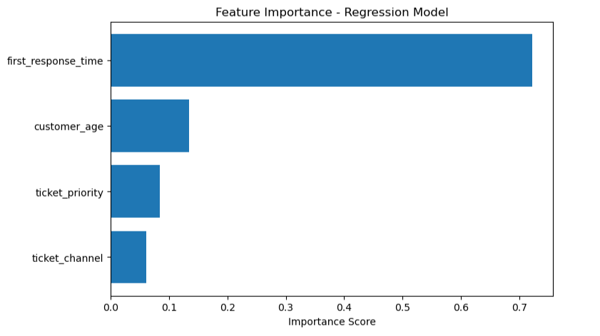

<h1 align="center">🤖 AI Customer Support Intelligence Dashboard</h1>

Real-time prediction of customer resolution time and customer abandonment risk using Machine Learning.

🌐 <b>Live Demo:</b> 
<a href="https://customer-stress-predictor-aditya-kumar-jha.streamlit.app/" target="_blank">
https://customer-stress-predictor-aditya-kumar-jha.streamlit.app/
</a>

<h2>📌 Project Overview</h2>

This project is an AI-powered web application designed to predict:

<ul>
<li>⏳ Estimated Resolution Time (Regression)</li>
<li>⚠️ Customer Abandonment Probability (Classification)</li>
<li>📊 Risk Category (Safe / High Risk)</li>
</ul>

The system uses a <b>dual Random Forest architecture</b> to provide real-time decision intelligence for customer support operations.

<h2>🖥 Application Preview</h2>

<h2>🚨 High Risk Example</h2>

<h2>🧠 Model Architecture</h2>

<ul>
<li>🌳 Random Forest Regressor → Predicts resolution time</li>
<li>🌳 Random Forest Classifier → Predicts abandonment probability</li>
<li>🏷 Feature Encoding using LabelEncoder</li>
<li>📦 Serialized Models (.pkl) for efficient inference</li>
</ul>

<h2>📊 Model Performance</h2>

<h3>🔹 Regression Metrics</h3>

<ul>
<li>Mean Absolute Error (MAE)</li>
<li>Root Mean Squared Error (RMSE)</li>
</ul>

<h3>🔹 Confusion Matrix</h3>

<h3>🔹 Feature Importance</h3>

<h4>Classification Model</h4>

<h4>Regression Model</h4>

<h2>🚀 Key Features</h2>

<ul>
<li>🎯 Dual ML Models (Regression + Classification)</li>
<li>📈 Real-time Abandonment Probability Gauge</li>
<li>🧠 Risk Categorization (Safe / High Risk)</li>
<li>⚡ Instant Inference from Serialized Models</li>
<li>🎨 Modern Dark-Themed Interactive Dashboard</li>
<li>🌐 Public Cloud Deployment</li>
</ul>

<h2>🛠 Tech Stack</h2>

<ul>
<li><b>Machine Learning:</b> Scikit-learn, Pandas, NumPy</li>
<li><b>Frontend:</b> Streamlit</li>
<li><b>Visualization:</b> Plotly</li>
<li><b>Deployment:</b> Streamlit Cloud</li>
</ul>

<h2>⚙️ Run Locally</h2>

<pre>
git clone https://github.com/AdityaKumar1988/customer-stress-predictor.git
cd customer-stress-predictor
pip install -r requirements.txt
streamlit run app.py
</pre>

<h2>📁 Project Structure</h2>

<pre>
customer-stress-predictor/
│
├── app.py
├── reg_model.pkl
├── clf_model.pkl
├── encoder_priority.pkl
├── encoder_channel.pkl
├── requirements.txt
├── dashboard-preview.png
├── high-risk-example.png
├── confusion-matrix.png
├── feature-importance-classification.png
├── feature-importance-regression.png
├── model-metrics.png
└── README.md
</pre>

<h2>🔮 Future Improvements</h2>

<ul>
<li>🔍 SHAP Model Explainability</li>
<li>📊 ROC Curve Visualization</li>
<li>🌍 REST API Integration (FastAPI)</li>
<li>🐳 Docker Deployment</li>
</ul>

<h2>👨‍💻 Author</h2>

<b>Aditya Kumar Jha</b> 
🔗 <a href="https://www.linkedin.com/in/aditya-kumar-jha-13661828a/">LinkedIn</a> 
💻 <a href="https://github.com/AdityaKumar1988">GitHub</a> 
🌐 <a href="https://aditya-portfolio-website-woad.vercel.app/">Portfolio</a>

